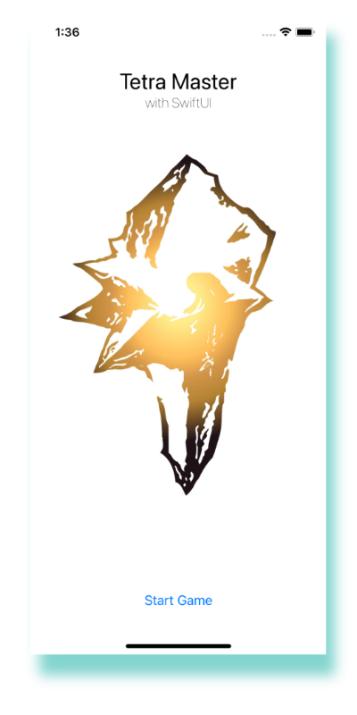
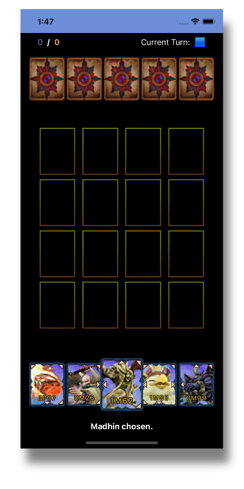
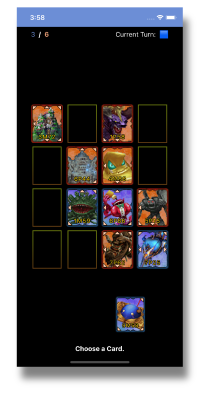
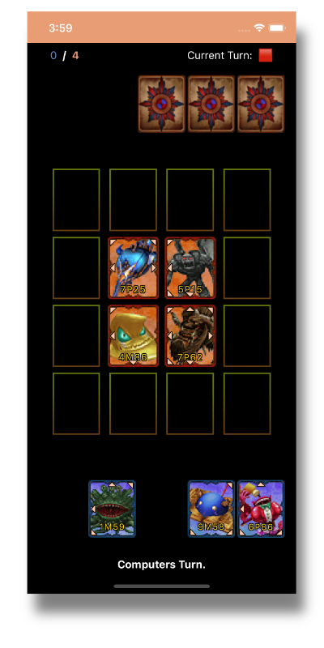

# TetraMaster with SwiftUI

## About the project:

As a fan of the Final Fantasy franchise I chose FF9 Tetra Master to look into SwiftUI the new method to build UI for apple devices (somewhat replacing/supplementing storyboards).
To get the original feel of the in-game version I used many original resources. According to https://www.jp.square-enix.com/caution.html Square Enix seems to be very restrictive about copyright infringements, so I stripped the code of all resources including images and sound that are from the original game. 

## Basic facts about the game:

- Matchmaking and battles were inspired by the original Card Game (LINK) 
- The player can choose 5 out of 9 random cards and can reshuffle the given cards if needed
- The computer gets 5 random cards
- The beginner of every match is set randomly
- The player can flip the computers cards to get an advantage
- The player can rematch after a game or reset to the starting screen

 
 

## Key Lessons learned:

- SwiftUI in general
- Structs and Views
- Publishing to GitHub directly from Xcode
- The quirks of and how to use the geometry reader in multiple layers of views

## Open Points:

The game is in a playable state but of course I could add endless features to it. Here are some I thought about:

### Game:
* Give the computer more brainpower especially at start and according to the values of the card
* Add random blocked fields like in the original game
* Upgrade the battle animation between cards
* Find higher resolution cards to play with
* Build a higscore list to track previous games
* Find a more suitable background than just black color
* Find a better solution for triangles and placing on cards

### Technical/Coding side:
* Some basic refactoring
* Sort out optionals and remove left force unwrappings
* Find a logic for multiple device sizing with Geometry Reader
* Find a better/modified solution for timing than „DispatchQueue.main.asyncAfter“

